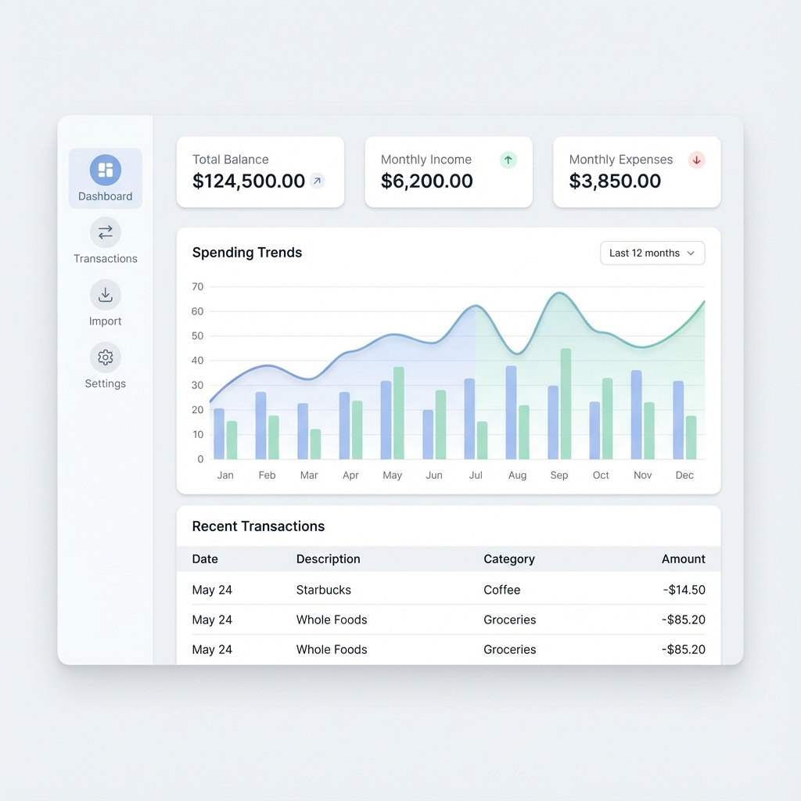

# Project Plan: Personal Finances

## 1. Project Concept
The goal is to build a **Personal Finances Web Application** that helps users track their financial health.
Key use cases include:
-   **Automated Data Ingestion**: Extracting transaction data from various source formats (CSV bank exports) to minimize manual entry.
    -   *Update*: Removed "one import per referenceDate" constraint to allow more flexibility.
-   **Transaction Management**: Viewing, categorizing, and managing financial transactions.
-   **Import Management**: Tracking import history and reverting accidental imports.
-   **Insights & Reporting**: (Future) Visualizing spending habits and trends.

## 2. Technology Stack & Rationale
The project is built using a modern TypeScript stack focusing on type safety and developer experience.

-   **Runtime Environment**: Node.js
-   **Language**: TypeScript (Strict type checking for robust data handling)
-   **Database**: SQLite (via `better-sqlite3`)
    -   *Rationale*: Simple, serverless, file-based database ideal for personal/local applications.
-   **ORM**: Drizzle ORM
    -   *Rationale*: Lightweight, type-safe, and has great DX with migration generation (`drizzle-kit`).
-   **Parsers**:
    -   `csv-parse`: For processing CSV exports from bank accounts.
-   **Frontend**: React (via Vite), Tailwind CSS for styling.
-   **Dev Tools**: `tsx` (TypeScript execution), Docker (Containerization).

## 3. UI Concept

_Proposed design for the main dashboard showing key metrics and trends._

## 3. Development Checklist

### Architecture & Setup
- [x] Initialize Project (package.json, tsconfig).
- [x] Set up Docker environment.
- [x] Configure Drizzle ORM & SQLite connection.

### Core Domain: Extraction
- [x] Define Transaction Types & Interfaces (`src/extraction/types.ts`).
- [x] Implement CSV Parser for Bank Exports (`src/extraction/parsers/csv-bank-parser.ts`).
- [x] Create Extraction Processor Logic (`src/extraction/processor.ts`).
- [x] Add Test Scripts for Extraction (`src/extraction/scripts/test-extraction.ts`) - *Replaced by CLI Command*
- [x] Implement CLI Command for File Processing (`src/index.ts`)

### Data Persistence
- [x] Implement Database Repository/Service for Transactions.
- [x] Connect Extraction logic to Database (Save parsed data).

### Features: Web Application (Planned)
- [x] Bootstap Frontend Project (`frontend/` directory).
- [x] Set up Tailwind CSS.
- [x] Implement Dashboard Layout (Sidebar + Main Content).
- [x] Build Dashboard Stats Cards (Balance, Income, Expense).
- [x] Build Recent Transactions Table.
- [x] Connect Frontend to Backend (API setup).
- [ ] Implement advanced filtering & search in API.
- [x] Implement Import Jobs Management (List & Delete/Revert).
- [x] Frontend: Import Jobs History Component.

### Next Steps
1.  Implement advanced filtering & search in API and Frontend.
2.  Add support for more file types (e.g. other banks).

---
*Note: Fixed a `db:migrate` error related to SQLite not supporting automatic default value changes by manually implementing the migration for the `import_jobs` table.*
